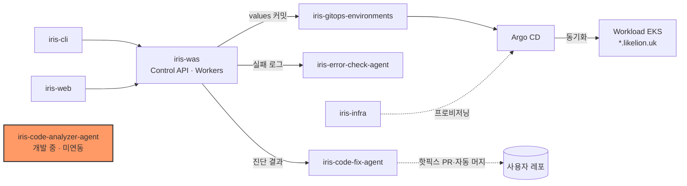
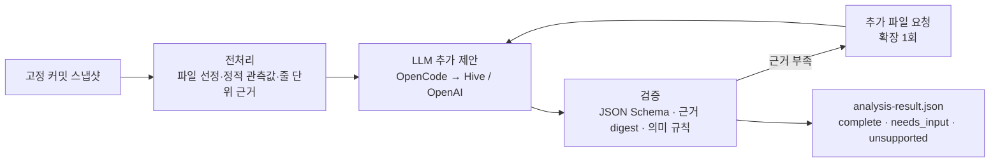

# iris-code-analyzer-agent

Likelion에 배포할 저장소를 소스 근거로 분석해 서비스 구성·빌더·포트·실행 명령·환경변수를 제안하는 Python 분석 패키지다.

[](https://github.com/2026-softbank-1/iris-code-analyzer-agent/actions/workflows/test.yml)


> **상태: 개발 중 — Likelion 배포 흐름(iris-was)에는 아직 연동되지 않음.**
> iris-was `main`에 분석기 호출 코드가 없고, iris-gitops-environments `platform/`과 iris-infra 플랫폼 values에 analyzer 항목이 없다(iris-infra Terraform에 ECR 저장소 `iris/code-analyzer-agent` 정의만 있다).
> 진행 중인 연동: iris-was 브랜치 `feat/ai-analysis-integration`(분석기 wheel 호출, PR 없음)과 [iris-was PR #6](https://github.com/2026-softbank-1/iris-was/pull/6)(빌드 인계, draft). 이 레포의 [PR #1](https://github.com/2026-softbank-1/iris-code-analyzer-agent/pull/1)(근거 검증·AI 기여 평가·빌드 인계)은 draft로 열려 있으나 커밋은 이미 `main`에 포함돼 있다.

## 시스템 내 위치



- 예정된 호출자: [iris-was](https://github.com/2026-softbank-1/iris-was)의 Analysis/Pipeline Worker가 이 패키지를 wheel로 고정해 호출한다([연동 설계](docs/1002-integration-design.md)).
- 빌드 인계 대상: iris-was Build Worker(Railpack·CodeBuild). 분석기는 Dockerfile 생성·이미지 빌드·ECR push를 하지 않는다.

## 지원 대상과 안전 원칙

- 지원: **Node.js workspace, Vite, Express, Dockerfile, Compose**. 다른 언어·프레임워크는 extractor 확장이 필요하다.
- **대상 저장소의 소스·설정·스크립트를 설치·빌드·실행하지 않는다.** 고정한 스냅샷을 자료로만 읽는다.
- 실제 `.env`·키·비밀 파일·symlink는 모델에 넘기지 않고, 환경 예시는 키만 추출하며 알려진 자격 증명 패턴은 가린다.
- OpenCode는 빈 임시 작업 디렉터리에서 탐색·셸 도구를 거절하고 구조화 응답만 허용한다(도구·설정 격리이며 OS 샌드박스는 아니다).

## 동작 흐름



- 정적 관측값(detected)은 서버가 보존하고, 모델은 suggested/unknown 추가 제안만 반환한다.
- 원본 관계·서비스·scope로 뒷받침되는 제안만 병합하고, 충돌은 관측값을 유지한 채 질문으로 남긴다.
- `complete`는 분석 필수 정보가 채워졌다는 뜻이며 실제 빌드·배포 성공을 뜻하지 않는다.

상세: [의미 검증](docs/semantic-evidence-verification.md), [모델 검토 프로토콜 v2](docs/model-review-protocol.md), [산출물·OpenCode 환경](docs/analysis-internals.md)

## 기술 스택

- Python 3.11+ (CI: 3.11·3.13), uv
- tree-sitter (JavaScript/TypeScript 파싱), jsonschema, httpx, PyYAML
- OpenCode 1.18.33 서버 경유 LLM: Hive `zai-org/glm-5.3-flash`(기본), OpenAI `gpt-6-luna`
- 테스트 프론트(선택): FastAPI + uvicorn

## 디렉터리 구조

```text
src/iris_analyzer/  패키지 (preprocess, opencode, verification, deployment, build, organization, demo …)
contracts/          WAS·프론트와 공유하는 TS 타입·JSON Schema 초안
docs/               설계·계약·사용법 문서
evaluations/        정답셋·평가 사례·보관 프롬프트
reports/            실측 평가·검증 보고서
scripts/            전처리·분석·평가 스크립트
fixtures/           테스트·시연용 샘플 저장소
tests/              pytest
```

## 빠른 시작

Python 3.11+와 [uv](https://docs.astral.sh/uv/)가 필요하다. 아래는 키 없이 동작하는 정적 분석이다.

```sh
uv sync --extra dev
uv run iris-analyzer analyze --repo fixtures/separated-web-api --offline --out artifacts/static
```

LLM 분석은 OpenCode를 설치하고 키를 넣은 뒤 `--offline`을 뺀다.

```sh
npm install -g opencode-ai@1.18.33
cp .env.example .env   # HIVE_AI=xxx 를 실제 키로 교체 (OpenAI는 OPENAI_API + OPENCODE_PROVIDER=openai)
uv run iris-analyzer analyze --repo /path/to/repo --env-file .env --out artifacts/analysis
```

- 종료 코드: 0 정상(결과 status 별도), 1 품질 기준 미달·검증 호출 실패, 2 오류.
- 모델 비용은 `artifacts/model-budget-ledger.json`에 예약·정산되며 기본 누적 상한은 USD 1이다.

다른 진입점(테스트 프론트 `iris-review-demo`, 배포 계획 `iris-deployment`, 빌드 인계 `iris-build-prepare`, 스크립트 CLI, `iris-organization`)과 공급자·예산 옵션은 [docs/usage.md](docs/usage.md)에 있다.

## 인터페이스 요약

- 라이브러리: `analyze_with_report(repo, on_event=...)` → `AnalysisResult` v1. 이벤트 `queued → preprocessing → analyzing → validating → succeeded`(+ expanding, needs_input, unsupported, failed).
- 스키마: `src/iris_analyzer/schemas/`, 공유 타입: `contracts/*.ts`.
- 빌드 인계 v2: 기존 Dockerfile 보존, 없으면 Railpack 경로 추천 → [build-preparation.md](docs/build-preparation.md)
- Analysis Gate: 단일 Dockerfile/Railpack 레포는 분석 생략(skip), 멀티 이미지 레포만 배포 단위·의존성 정적 추출(`iris-analysis-gate`) → [analysis-gate.md](docs/analysis-gate.md)
- 로그 기반 개선 인계: draft 계약만 있음 → [remediation-handoff.md](docs/remediation-handoff.md)

상세: [공통 계약](docs/implementation-contract.md), [WAS 연결 준비](docs/control-plane-readiness.md)

## 배포

- 운영 서버·이미지가 없다. iris-infra는 "Code Analyzer 서비스화는 후속 범위"로 두고 있다.
- 현재 사용 방식은 로컬 CLI·라이브러리이며, 연동 시 iris-was가 wheel로 고정해 Worker 안에서 실행하는 형태다.
- CI(`.github/workflows/test.yml`)는 모든 push·PR에서 모델 비용 없는 ruff·pytest만 실행한다.

## 현재 상태 / 한계

- 구현: 전처리·정적 분석, OpenCode 경유 LLM 추가 제안, 스키마·의미 검증, 배포 계획·Terraform/Helm 템플릿 출력, 빌드 인계 v2, Organization 다중 레포 분석([문서](docs/1002-organization-system.md)).
- 미연동: iris-was 운영 흐름, 플랫폼 공용 예산·DB 저장, 오류 에이전트·WAS 큐와의 개선 인계.
- 한계: 동적 import·라우트·포트와 런타임 분기는 unresolved로 남긴다. 인증은 middleware 이름만으로 확정하지 않는다. 테스트는 모듈 단위이며 전체 배포 E2E를 뜻하지 않는다.

## 문서

- [사용법](docs/usage.md) · [산출물·OpenCode 환경](docs/analysis-internals.md) · [비용·worker 연결·AI 평가·개선 인계](docs/operations.md)
- 설계: [1002 연동 설계](docs/1002-integration-design.md), [Organization](docs/1002-organization-system.md), [배포 계획](docs/deployment-planning.md), [AI 판단 정책](docs/ai-judgment-policy.md)
- 평가 보고서: [품질](reports/quality-evaluation.md), [AI 판단](reports/ai-judgment-evaluation.md), [OpenAI 검증](reports/openai-validation.md)
