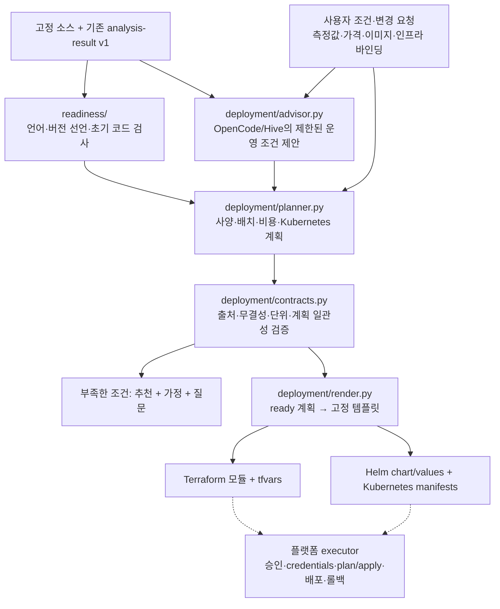

# 분석 → 배포 계획 → 실행 설정

제공 범위는 코드에서 확인한 정보를 보존하면서 운영 조건을 제안하고, 검증된 계획을 고정된 실행 템플릿의 입력으로 변환하는 단계까지다. 실제 Terraform apply, 클러스터 접속, 이미지 빌드, DB 생성과 배포 승인은 플랫폼 executor가 담당한다.



## 문서와 모듈 경계

| 문서 | 내용 | 의미 |
| --- | --- | --- |
| analysis-result v1 | 명령, 포트, 환경 키, DB·스토리지, 서비스 연결, 줄 근거 | 기존 계약 유지. complete는 분석 프로필 충족. |
| iris.source-readiness.v1 | 언어, 소스의 버전 제약, Docker/Compose 이미지 선언·digest, 빠른 검사와 coverage | installed patch version·실제 빌드 성공을 확정하지 않는다. |
| iris.deployment-plan.v1 | 대상, 인스턴스, 운영 조건, 비용, 네트워크·데이터와 workload 설정 | 추천에는 provenance와 가정·측정 참조가 붙는다. |
| iris.execution.v1 | 고정 Terraform 입력, Helm values, native manifests, 실행 정책 | executionEligible는 템플릿 생성 가능 여부다. deploymentAuthorized는 항상 false. |
| iris.deployment-dossier.v1 | 위 결과, 입력 연결, benchmark 요청, 한계 | WAS나 이후 에이전트가 가공할 통합 JSON이다. 원문 소스는 포함하지 않는다. |

`readiness/`는 전체 원본 bytes를 digest로 확인할 수 있는 마스킹된 자료에만 구문·JSON·import·명령 파일·컨테이너 검사를 수행한다. 일부만 제공되거나 마스킹으로 원본 일치가 증명되지 않는 파일은 skipped로 기록한다. 생성될 dist 파일의 부재는 확인 요청이며 빌드 실패로 확정하지 않는다. express-rate-limit의 literal 설정도 운영 검토 항목으로 추출한다. 해당 설정은 실제 aggregate 처리 용량을 의미하지 않는다. dependency CVE 검사와 의미적 정확성 검사는 이 빠른 검사에 포함되지 않는다.

## 미정인 조건을 추천하는 방식

조건을 먼저 정하지 않아도 초기안을 생성한다. AI 모드에서는 제한된 JSON 제안만 받으며, 결정된 값은 `planner.py`가 사용자 조건·검증된 측정·고정 사양 목록과 병합한다. 원본 코드에서 감지한 값을 모델 추천으로 바꾸지 않는다. 정적 모드는 같은 계약으로 정책 기반 초기안을 반환하고 plannerMode=policy를 기록한다.

- 현재 팀의 AWS/Kubernetes 방향을 초기 정책으로 사용한다. 미정인 대상은 AWS EKS / 서울 / x86_64를 제안하며 배치·플랫폼 호환성은 가정으로 남긴다.
- 미정 트래픽은 테스트 시나리오로 제안한다. 실제 수요 예측은 아니며 사용자 RPS와 가용성 입력이 있으면 이를 우선한다.
- 기본 workload footprint는 Node와 static server의 초기 envelope다. source-only memory/CPU/instance/cost 출처는 검증기가 거절한다.
- 확인된 월 비용의 두 배를 USD10 단위로 올린 잠정 예산을 제안한다. 이 운영 여유 가정은 실제 총요금이나 지출 승인·예산 충분성의 증거가 아니다. 사용자 월 예산 cap은 별도 필드로 보존한다.
- 검증된 같은 소스·서비스의 부하 측정이 있으면 peak memory와 CPU에 50% 여유를 적용하고, 검증한 용량 시험(capacityValidated=true)에만 측정 RPS의 70%를 목표로 replicas를 계산한다. 일반 고정 부하의 관측 RPS는 최대 용량으로 해석하지 않으며, 더 높은 트래픽에는 새 부하 시험을 요청한다. 요청 자원·surge·노드 20% 여유와 burst CPU baseline을 고려해 후보를 선택한다. 이는 측정한 시나리오의 초기 추정이다.
- build/test 통과를 serving capacity로 사용하지 않는다. 부하 자료는 충분한 시간·동시성·자원·RPS·p95·오류율, 최신성 및 snapshot/service 일치가 필요하다. 측정 환경과 대상의 차이를 검토해야 한다.

`operatingPolicy`에는 제안 RPS·가용성·잠정 예산과 사용자 cap이 구조화되어 있다. `request`에 없던 조건을 사용자 확정 값으로 기록하지 않는다.

## 가격과 비용

`deployment/catalogs/aws-seoul.json`은 2026-10-01 확인한 AWS 공개 요금 snapshot이다. Linux shared On-Demand EC2와 gp3 용량은 AWS Price List의 서울 리전 데이터를 사용한다. EKS standard-support cluster 단가는 별도 공식 페이지를 참조한다. 각 요금 항목에 sourceUrl이 있다. 30일 이상 오래되거나 지역이 일치하지 않는 요금은 계산에서 제외한다.

현재 비용은 EKS control plane, worker instance, node gp3 용량을 계산한다. NAT/VPC endpoint, LB·IPv4·egress, DB·앱 볼륨·backup·logs·registry 등은 unknown 항목이다. 부분 비용의 monthlyTotalUsd는 null이며, 확인한 line item 합계는 knownMonthlyCostFloorUsd로 표시한다. 이 합계를 총비용으로 바꾸거나 다른 지역의 요금을 재사용하는 계획은 거절한다. 주어진 예산을 확인할 수 없으면 실행 질문을 남긴다.

가격 출처: [AWS EC2 Price List](https://pricing.us-east-1.amazonaws.com/offers/v1.0/aws/AmazonEC2/current/ap-northeast-2/index.json), [EKS pricing](https://aws.amazon.com/eks/pricing/), [EC2 instance specifications](https://docs.aws.amazon.com/ec2/latest/instancetypes/gp.html), [burst CPU credits](https://docs.aws.amazon.com/AWSEC2/latest/UserGuide/burstable-credits-baseline-concepts.html).

## 요청과 변경

```json
{
  "schemaVersion": "iris.planning-request.v1",
  "target": {
    "stack": null,
    "cloud": null,
    "region": null,
    "architecture": null,
    "environment": "test"
  },
  "constraints": {
    "monthlyBudgetUsd": null,
    "expectedRps": null,
    "availability": null
  }
}
```

`target.stack`, cloud/region/architecture, constraints, overrides.resources/replicas/instanceType 및 검증된 bindings를 바꾸면 새로운 planDigest를 가진 계획을 만든다. 명시적 요청을 조용히 다른 스택으로 대체하지 않는다. 지원되지 않는 GKE·VM·다른 cloud 요청도 원본을 보존하고 unsupported와 adapter 질문을 반환한다. 첫 고정 변환 대상은 aws_eks와 existing_kubernetes다.

WAS는 공개 사용자 입력과 worker가 검증한 자료를 분리해야 한다. verified 가격·측정·imagePlatforms·runtime/network/storage/DB 조건은 trusted worker의 확인 값이며, 사용자 JSON의 boolean만으로 실제 검증이 이루어지는 것은 아니다. SHA256은 변조·혼합 검출용이며 서명이나 인증을 대신하지 않는다. executor는 원본 analysis도 전달해 service/port/evidence와 plan을 검증한다.

## 고정 템플릿의 지원 범위

- AWS EKS: **기존 VPC의 private subnet과 두 AZ**를 입력받고 IAM, private API cluster, managed node group, encrypted gp3 launch template을 구성한다. 검증한 administrator role, 지원 Kubernetes 버전, private egress와 executor 접근이 필요하다. 이 템플릿은 VPC/NAT/DB를 생성하지 않는다.
- 기존 Kubernetes: cluster context와 실제 allocatable capacity가 필요하다.
- 앱: Deployment, ClusterIP Service, TLS Ingress, HTTP/TCP startup/readiness/liveness probe, requests/limits, replicas, Secret key reference, PVC, PDB, rolling update와 Helm atomic/wait 정책을 출력한다.
- replicas가 많을 때 zone affinity는 preferred 정책이다. 실제 zone placement나 HA/SLA를 보장하지 않는다. RWO multi-writer·surge 충돌과 단일 pod의 자원 fit은 차단한다.
- 기존 claimName은 참조만 한다. 새 볼륨은 명시된 size/StorageClass로 이름을 고정해 PVC를 만든다. source host bind mount와 Secret의 실제 값은 자동 복사하지 않는다.
- 실행 이미지는 immutable digest와 검증된 platform을 요구한다. 모델이 source command를 Terraform shell로 넣지 못한다. restricted securityContext와 실제 이미지의 호환성을 먼저 확인해야 한다.

Terraform provider는 hashicorp/aws 6.14.1과 lockfile로 고정했다. Terraform fmt/validate, Helm lint/template와 Kubernetes 1.33 strict schema를 검증했다. 실행 artifact의 내용이 같은 plan/template과 달라진 경우 재사용을 거절한다. DB의 데이터·schema rollback은 Helm rollback과 별도 책임이다.

Kubernetes 근거: [resource requests/limits](https://kubernetes.io/docs/concepts/configuration/manage-resources-containers/), [probe configuration](https://kubernetes.io/docs/tasks/configure-pod-container/configure-liveness-readiness-probes/).

## 라이브러리와 CLI

```python
from iris_analyzer.deployment.dossier import prepare_readiness
from iris_analyzer.deployment.client import plan_with_report

# analysis는 기존 analyze_with_report(...).result
readiness = prepare_readiness(source_root, analysis=analysis)
dossier, report = plan_with_report(analysis, readiness, request)
# 원문을 모델에 다시 넘기지 않고 read-only facts와 제한된 advice만 사용
```

```sh
uv run iris-deployment --repo ../tested_code/Temp_log \
  --offline --out artifacts/deployment-static
uv run iris-deployment --repo ../tested_code/Temp_log \
  --env-file ../.env --out artifacts/deployment-ai
# 필요 시 --request planning-request.json, --opencode-executable /path/to/opencode
```

출력 폴더는 분석 소스 바깥으로 지정한다. 산출물은 analysis/, source-readiness.json, readiness-context/, deployment-dossier.json, plans/<planDigest>/에 저장한다. blocked 계획에는 실행 가능한 manifests를 만들지 않는다.

테스트 API는 review 생성 시 planning_request를 받는다. `POST /api/reviews/{id}/plan`은 기존 소스 분석을 재사용해 새 조건으로 계획만 다시 만든다. `GET /api/reviews/{id}/plan`은 전체 dossier를 다운로드한다. 실제 WAS에 정식 route/job/DB 계약을 추가하지는 않았다.

새 스택은 동일한 계획 계약을 읽는 adapter와 고정 compiler/template, 검증된 사양·지역 요금 자료, positive/negative fixture를 추가하는 방식으로 확장한다. 미지원 요청을 처리하기 위해 임의 IaC를 생성·실행하지 않는다.

## 제한된 부하·자원 측정

`iris-measure`는 trusted builder가 준비해 이미 실행 중인 로컬 컨테이너의 자원과 지정 GET 시나리오를 측정한다. 소스를 설치·빌드하거나 컨테이너를 생성·시작하지 않는다. 컨테이너의 `iris.sourceSnapshotId`와 `iris.serviceId` label이 요청과 일치하고, URL port가 실제 loopback published port에 연결된 경우에만 진행한다. local Unix Docker socket, redirect/proxy 제외, 시간·요청률·동시성·응답 크기 한도를 적용한다.

```sh
uv run iris-measure --container-id <running-container-id> \
  --url http://127.0.0.1:18080/approved-test-path \
  --source-snapshot-id <snapshot-sha256> --service-id <service-id> \
  --duration 60 --rps 20 --concurrency 4 --out artifacts/measurement.json
```

결과의 measurement를 planning request의 measurements 배열로 전달한다. collectorReport는 image config ID, image architecture, 컨테이너 제한과 테스트 조건을 기록한다. Docker image config ID는 registry manifest digest와 구분한다. 자원은 호스트 전체나 단위 테스트 프로세스가 아닌 container 통계다. CPU family·emulation·production hardware·실제 workload mix가 다르면 다시 측정해야 한다. 실패 시 measurement=null이며 실제 측정을 한 것처럼 채우지 않는다.

Docker 데몬 복구 후 두 제공 저장소의 격리 빌드·테스트와 세 번의 60초 부하 시험을 수행했다. Temp_log의 단일 클라이언트 20 RPS는 설정된 rate limit 때문에 대부분 HTTP 429를 반환하여 사양 근거에서 제외했다. 1 RPS와 포트폴리오 50 RPS의 성공 시나리오로 초기 footprint를 보정했다. 이 결과는 ARM64 로컬 컨테이너와 작은 합성 데이터의 특정 GET 요청 관측이며, 최대 용량·production SLA가 아니다. 상세값과 새 검증 범위는 [실제 런타임 평가](../reports/runtime-capacity-evaluation.md)에 기록한다.
